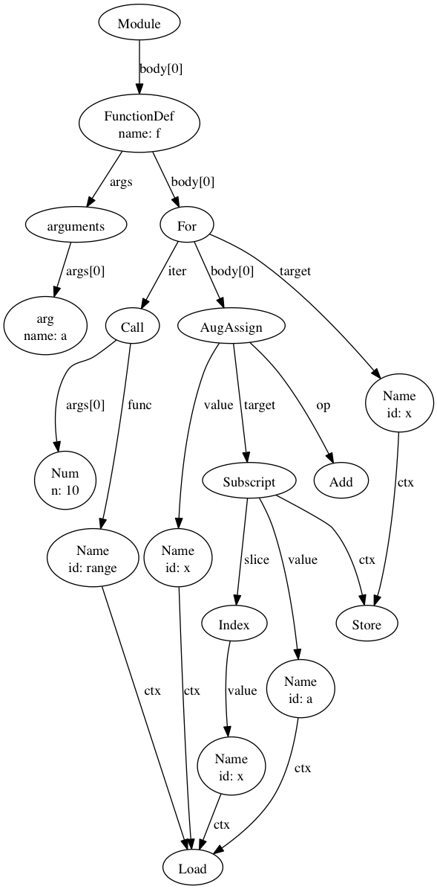
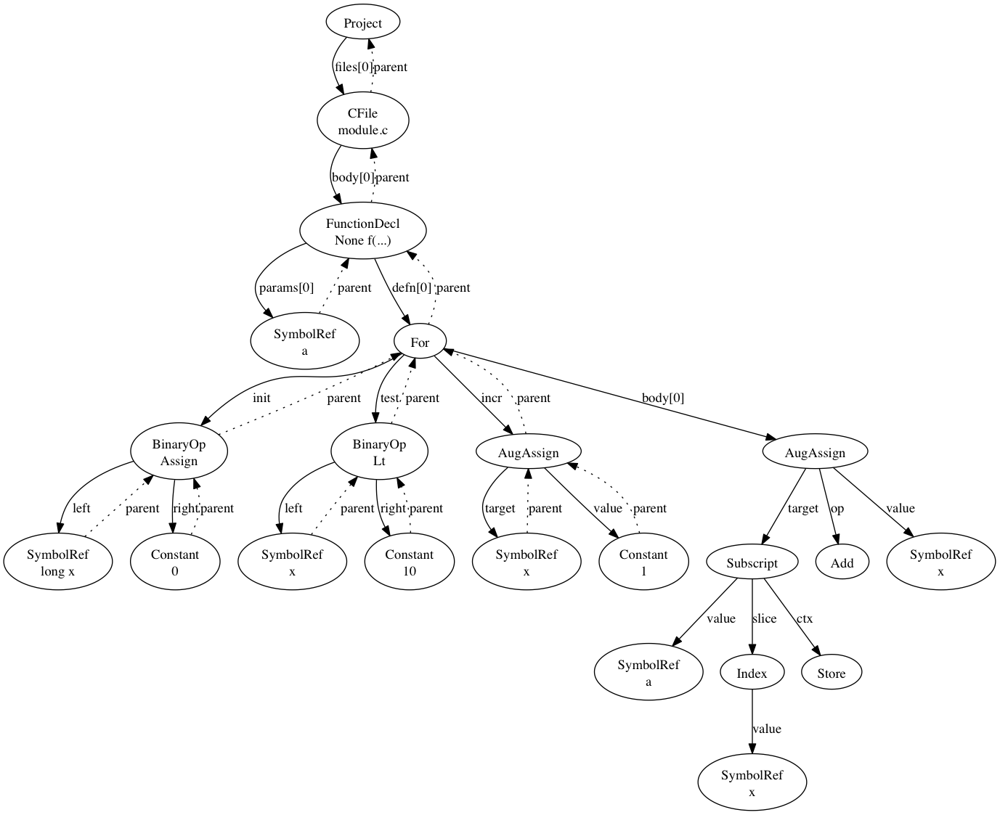

.. ipython visualization:

Using IPython for AST Visualization
===================================

IPython provides a decent environment for visualizing the transformation of the abstract syntax trees
(AST) of the specializaed kernels.  Following these simple guidelines can make it easier to write and
debug the multiple node transformation passes that are necessary to implement a specialized kernel

Installing IPython
------------------

``ipython`` can be installed in several different ways depending on your platform:  See
`installing ipython <http://ipython.org/install.html>`_.  Just using ``pip`` seems to work
fine on OSX.

Starting IPython
----------------

In the shell::

        cd $CTREE
        ipython notebook

This will start an ``ipython`` server and open the dashboard window in the browser.  From the dashboard click
``New Notebook``.  You will add one or more sections of python code in cells on the ``notebook`` page.  The ``ipython``
interpreter for this page will be running just as if you had started the regular ``python`` interpereter.

Let's Visualize
---------------

In the first cell::

        import ctree

        def f(a):
            for x in range(10):
                a[x] += x

        tree1 = ctree.get_ast(f)
        ctree.ipython_show_ast(tree1)

Hit the play button, the tree should render and a new cell should be created below the tree image.

In the next cell let's transform that tree using the basic py conversions::

        from ctree.transformations import PyBasicConversions

        t = PyBasicConversions()
        tree2 = t.visit(tree1)
        ctree.ipython_show_ast(tree2)

Once again hit the play button and the transformed tree will appear

